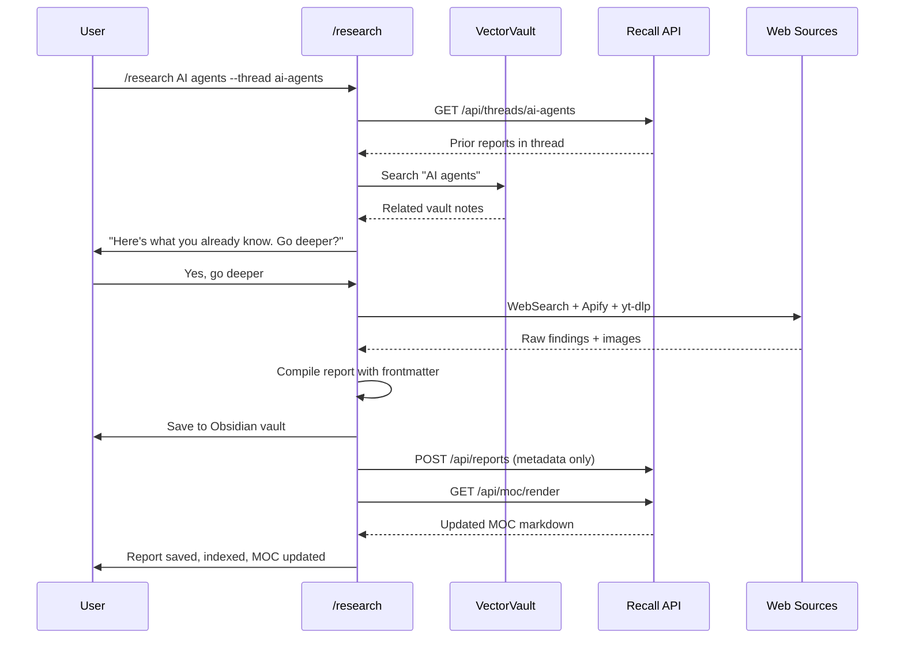

# Recall

A research index service that tracks reports, tags, and threads — giving your research system memory.

## What It Does

Recall is a lightweight Flask API + web dashboard that manages research report metadata. It answers questions like:

- What have I already researched about this topic?
- How has my understanding evolved over time?
- What topics connect to each other?

Reports live in your local vault (Obsidian, markdown files, etc.). Recall indexes the **metadata** — titles, tags, threads, dates, sources — and provides a dashboard to browse and explore your research landscape.

## Features

- **Report Registration** — register research reports with tags, threads, and metadata via API
- **Research Threads** — group related reports into chains that show how understanding evolves
- **Tag System** — automatic tagging with co-occurrence tracking
- **Tag Graph** — D3 force-directed visualization showing how topics connect
- **MOC Generation** — auto-generate an Obsidian-compatible Map of Content
- **Backfill** — import existing markdown reports with auto-inferred tags and threads
- **Dashboard** — clean web UI with Reports, Threads, and Tag Graph tabs

## Quick Start

```bash
# Clone and setup
git clone https://github.com/jbharvey1/recall.git
cd recall
python3 -m venv .venv
source .venv/bin/activate  # or .venv\Scripts\activate on Windows
pip install -r requirements.txt

# Configure
cp .env.example .env
# Edit .env with your cert paths and port

# Run
python app.py
# Dashboard at https://localhost:9400
```

## Configuration

All config is via `.env` (see `.env.example`):

| Variable | Default | Description |
|----------|---------|-------------|
| `PORT` | 9400 | Server port |
| `SSL_CERT_PATH` | `certs/server.pem` | TLS certificate path |
| `SSL_KEY_PATH` | `certs/server-key.pem` | TLS private key path |
| `DB_PATH` | `research.db` | SQLite database path |

## API

| Method | Path | Description |
|--------|------|-------------|
| `POST` | `/api/reports` | Register a report |
| `GET` | `/api/reports` | List reports (filter: `?tag=`, `?thread=`) |
| `GET` | `/api/reports/:id` | Get report by ID |
| `GET` | `/api/threads` | List all threads |
| `GET` | `/api/threads/:name` | Thread detail with timeline |
| `GET` | `/api/tags` | List tags with counts |
| `GET` | `/api/tags/graph` | Tag co-occurrence graph data |
| `GET` | `/api/moc/render` | Render Obsidian MOC markdown |
| `GET` | `/api/stats` | Index statistics |
| `GET` | `/api/health` | Health check |

### Register a Report

```bash
curl -sk -X POST https://localhost:9400/api/reports \
  -H "Content-Type: application/json" \
  -d '{
    "path": "reports/my-report.md",
    "title": "AI Agent Architectures",
    "topic": "AI Agents",
    "tags": ["ai", "agents"],
    "thread": "ai-agents",
    "date": "2026-04-02",
    "sources": ["web", "youtube"],
    "word_count": 15000
  }'
```

## Backfill Existing Reports

Import existing markdown reports into the index:

```bash
# Set environment variables
export RECALL_API=https://localhost:9400
export RECALL_REPORT_DIRS="/path/to/reports,/path/to/more/reports"
export RECALL_VAULT_ROOT="/path/to/vault"

python backfill.py
```

The backfill script reads each `.md` file, extracts the title from the first `# heading`, infers tags from content keywords, and registers via the API.

## Architecture

Recall is designed to run on a separate server (e.g., AWS EC2) while your research tools run locally. Reports (full content) never leave your local machine — only metadata is sent to the server.

```
┌─────────────────────────────────────┐       ┌─────────────────────────────────────┐
│  YOUR PC                            │       │  AWS EC2                            │
│                                     │       │                                     │
│  /research ─┬─► VectorVault        │       │  Flask API (9 endpoints)            │
│             ├─► WebSearch           │       │    ├─► SQLite Index                 │
│             ├─► Apify               │ ────► │    └─► Web Dashboard                │
│             ├─► yt-dlp              │  TLS  │         ├── Reports                 │
│             └─► Obsidian Vault      │ ◄──── │         ├── Threads                 │
│                 (reports + images)   │  MOC  │         └── Tag Graph               │
│                                     │       │                                     │
└─────────────────────────────────────┘       └─────────────────────────────────────┘
         Content stays here                         Metadata only
```

### Data Flow



## Tech Stack

- Python 3.12+, Flask, SQLite (WAL mode)
- D3.js for tag graph visualization
- Single-file SPA dashboard (no build step)

## Tests

```bash
python -m pytest tests/ -v
```

## License

MIT
